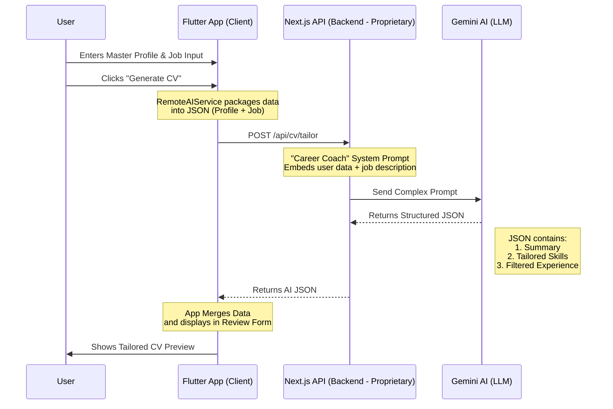

# CV Fast

> **AI-Powered Resume Builder for Indonesian Job Seekers**

Create professional, ATS-friendly resumes tailored to specific job postings using AI. Built with Flutter for cross-platform mobile experience.

[](https://flutter.dev)
[](LICENSE)
[](CONTRIBUTING.md)

---

## Features

- **AI-Powered Tailoring**: Automatically optimize your resume for specific job descriptions
- **4 Professional Templates**: ATS, Modern, Creative, and Executive layouts
- **Cross-Platform**: iOS and Android support
- **Indonesian-First**: Built with local job market in mind (universities, regions auto-complete)
- **Smart Drafts**: Save and manage multiple resume versions
- **PDF Export**: Professional PDF generation with template styling
- **Profile Pictures**: Optional photo support for Modern/Creative templates
- **Dark Mode**: Full dark theme support

---

## Architecture

This is the **open-source Flutter frontend**. The AI backend is proprietary and hosted separately.



### Why Open Source?

**This repository contains only the Flutter app.** The AI backend remains proprietary, which allows:

- **Open Development**: Community contributions, bug fixes, and UI improvements
- **Portfolio Showcase**: Demonstrate clean architecture and Flutter best practices
- **Monetization Security**: Backend AI logic and API keys stay protected
- **Play Store Revenue**: Open source ≠ free. You can still charge for the app or use ads/IAP

---

## Quick Start

### Prerequisites

- Flutter SDK `>=3.0.0`
- Dart `>=3.0.0`
- Android Studio / Xcode (for mobile deployment)
- **Backend API URL** (Contact maintainer for access or self-host the backend)

### Installation

1. **Clone the repository**
   ```bash
   git clone https://github.com/Amrlmlna/cv-master.git
   cd cv-master/cv_master
   ```

2. **Install dependencies**
   ```bash
   flutter pub get
   ```

3. **Configure Backend URL**
   
   Create `.env` file in the root:
   ```env
   API_BASE_URL=https://your-backend-url.com
   ```

4. **Run the app**
   ```bash
   flutter run
   ```

---

## Project Structure

```
lib/
├── core/
│   ├── constants/         # App constants (colors, universities, regions)
│   ├── router/           # GoRouter navigation setup
│   ├── services/         # External services (AI, analytics)
│   └── utils/            # PDF generator, helpers
├── data/
│   ├── datasources/      # Remote API clients
│   ├── repositories/     # Repository implementations
│   └── models/           # Data transfer objects
├── domain/
│   ├── entities/         # Core business objects
│   └── repositories/     # Repository interfaces
└── presentation/
    ├── cv/               # CV creation flow
    ├── profile/          # User profile management
    ├── drafts/           # Saved drafts
    ├── notifications/    # Notification center
    └── common/           # Shared widgets

tool/
├── fetch_regions.dart    # Script to generate local region data
└── fetch_universities.dart # Script to generate local university data
```

**Clean Architecture Layers:**
- **Presentation**: Flutter widgets, pages, providers (Riverpod)
- **Domain**: Business logic, entities, use cases
- **Data**: API communication, local storage, repositories

---

## Development

### Running Tests
```bash
flutter test
```

### Code Analysis
```bash
flutter analyze
```

### Building for Release
```bash
# Android
flutter build apk --release

# iOS
flutter build ios --release
```

---

## Templates

| Template | Description | Best For |
|----------|-------------|----------|
| **ATS** | Simple, single-column, text-focused | Applicant Tracking Systems |
| **Modern** | Two-column with sidebar, blue accents | Tech, startups, creative roles |
| **Creative** | Bold purple header, unique styling | Design, marketing, media |
| **Executive** | Traditional, formal layout | Senior positions, corporate |

---

## Contributing

Contributions are welcome! Please read our [Contributing Guide](CONTRIBUTING.md) first.

### Areas for Contribution
- Bug fixes
- UI/UX improvements
- Localization (currently Indonesian + English)
- Template designs
- Documentation

### Development Workflow
1. Fork the repository
2. Create a feature branch (`git checkout -b feature/amazing-feature`)
3. Commit your changes (`git commit -m 'Add amazing feature'`)
4. Push to the branch (`git push origin feature/amazing-feature`)
5. Open a Pull Request

---

## License

This project is licensed under the **MIT License** - see the [LICENSE](LICENSE) file for details.

**Note:** While the Flutter app is open source, the backend API and AI integration remain proprietary.

---

## Acknowledgments

- **Flutter Team**: For the amazing framework
- **Google Gemini**: For powering the AI features
- **Community Contributors**: For bug reports and improvements

---

## Support

- Email: cvfast.contact@gmail.com
- Issues: [GitHub Issues](https://github.com/Amrlmlna/CleVer/issues)
- Docs: [Developer Guide](DEVELOPER_GUIDE.md)

---

## Roadmap

- [ ] English localization improvements
- [ ] More CV templates (Minimalist, Bold, etc.)
- [ ] Cover letter generation
- [ ] LinkedIn profile import
- [ ] Web version

---

